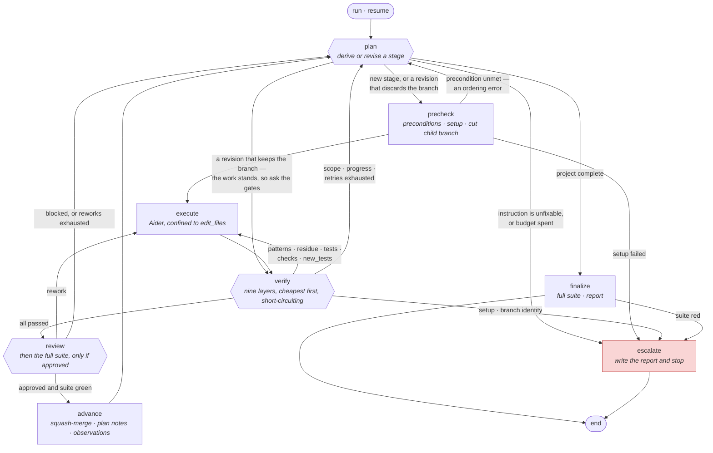

# Refactor Orchestrator

Drives a long, multistage refactor by pairing a **local executor model** with two
paid ones: a **planner** that decides what to do next, and a **reviewer** that
decides whether it was done acceptably.

The operating goal is to run as long as feasible without a human. A ten-page plan
should execute in one unattended pass, producing a branch of granular,
individually green, individually reviewed commits you can examine and deploy from
on your own schedule.

[docs/architecture.md](docs/architecture.md) describes the system as built and is
the authority on *why* it works this way. This file is how to use it.

## Install

```bash
uv sync --group dev
uv run orchestrator --help
```

Requires Python 3.11+, `git`, and — for agent stages — `aider` on PATH.

## The four terms

| Term | What it is | Maps to |
|---|---|---|
| **project** | A body of work defined by a plan document | `projects/<slug>/` and a long-lived project branch |
| **stage** | One unit of work — the shippable unit | A child branch, squash-merged to the project branch |
| **attempt** | One executor invocation within a stage | A counter |
| **run** | One resumable execution session | `projects/<slug>/runs/<id>/`; no branch |

There is **no static stage list**. The planner derives each stage from the plan
document as the run proceeds.

## The loop

Every arrow that is not the happy path is a failure with somewhere specific to
go. That is most of the diagram, and it is the point: the design goal is that a
run stops for a good reason or not at all, so each way a stage can go wrong has
a named destination rather than an exit code.



`resume` re-enters at whichever of `plan`, `precheck` or `verify` matches how the
run stopped — see [Escalation tiers](#escalation-tiers).

Three properties are easier to see here than to state. **Only three nodes reach
`escalate`**, and `review` is not one of them: a rejected stage is a planning
problem with a planning fix. **`advance` has exactly one exit**, so there is no
path that lands a stage and then does something other than plan the next one.
And **every cycle passes through a bounded counter** — executor attempts,
reworks, or planner interventions — so no loop in the diagram can run forever.

## Lifecycle

```bash
orchestrator init docs/my_plan.md      # draft a config from a plan document
orchestrator validate <slug>           # prove it works on this host
orchestrator approve <slug>            # record that you read it
orchestrator run <slug>                # go
orchestrator resume <run_id>           # continue after an interruption or escalation
orchestrator status <run_id>           # where it stopped and why
```

`init` may prompt — it's one-time human setup. `run` and `resume` execute
unattended and never block on input.

`validate` proves the config works *on this host* before you're asked to approve
it, so approval is a review of policy rather than of whether `bin/test` exists.
`approve` records a hash of the exact bytes you read; editing the config
invalidates it. There is no `approved: true` field, because such a field could be
set by anything.

## The capability partition

Three models, three non-overlapping capabilities. This is the core safety
property; everything else is mechanism.

| Role | May write | May not |
|---|---|---|
| **Executor** (local, via Aider) | Product code inside the stage's `edit_files` | Anything outside it; any command |
| **Planner** (Anthropic) | Stage specs — declarative fields only — plan revisions, the status log | Product code; **any executable field** |
| **Reviewer** (OpenAI) | Nothing | Everything |

The planner and reviewer both **read** the repository through the same bounded
tools — read a file, list files, search — under separate per-role line and call
budgets. The reviewer got them because a diff does not always carry the fact that
settles it: a stage deleting a declaration is safe exactly when something
elsewhere still covers what it did, and that file is not in the diff. A gate that
cannot reach its evidence produces verdicts indistinguishable from judgement,
and the artifact reads the same either way — so the run log records what each
role *looked at*, not only what it decided.

**The planner may never author a command.** It is enforced twice: its
structured-output schema has no field for one, and its response is filtered
against an allowlist regardless. The orchestrator never runs a shell command that
originated from model output — every command it executes is declared by you in an
approved config.

Where the planner needs to influence a command, it supplies *arguments*:

```yaml
scoped_test_command: "docker compose run --rm test bundle exec rspec {paths}"
```

`{paths}` is filled from the stage diff, optionally widened by planner-declared
spec globs. Paths are declarative; the command string is yours.

## Branch topology

```
main
 └── feature/thing                    # cut once; the tool never merges it

feature/thing-stage/001-<id>          # child branch; squash-merged, then deleted
feature/thing-stage/002-<id>
```

Child branches sit **beside** the project branch, not under it — git refs are
filesystem paths, so `refs/heads/feature/thing` and
`refs/heads/feature/thing/stage-001` cannot coexist.

A stage squash-merges on approval, so Aider's intermediate commits — some red,
since it commits before it tests — never reach the project branch. That's how
"every commit on the project branch is green" and "Aider commits before testing"
are both true.

The outer merge to `main` is yours. The tool never pushes.

## The verify gate

Ordered cheapest-first, short-circuiting. Routing is three-way:

| # | Gate | On failure |
|---|---|---|
| 0 | `setup_command` | **Human** — a broken environment isn't a planning defect |
| 1 | Branch identity — HEAD where expected, nothing rewritten | **Human** — a containment breach doesn't negotiate |
| 2 | Scope — the diff is non-empty, touches no plan document, and stays inside `edit_files` | Executor if it produced nothing; **Planner** otherwise — widen the stage, or revert just those paths |
| 3 | Progress — this diff is not byte-identical to the last one | **Planner** — feedback changed nothing, so another attempt buys nothing |
| 4 | `forbidden_patterns` against **added lines only** | Executor retry |
| 5 | `must_not_remain` against **file contents** | Executor retry |
| 6 | `test_command` (re-run once before consuming a retry) | Executor retry |
| 7 | `checks` — each must exit zero | Executor retry |
| 8 | `require_new_tests` — a test file was touched, and what it touched is not empty | Executor retry |

Layers 4 and 5 read almost identically in prose and are opposites in a diff.
`forbidden_patterns` asks what the stage **introduced**; `must_not_remain` asks
what **survived**. A stage told to delete something needs the second, and the
first will never notice.

The emptiness half of layer 8 applies whether or not the stage was required to
write tests — `require_new_tests` governs whether a stage *must* write them, not
whether a file it did write is worth anything.

A scope violation **never discards the branch.** The child branch is already the
quarantine, so containment doesn't require destroying work: the planner gets the
out-of-scope path list, and if it widens `edit_files` the existing work stands.
Only paths it declines get reverted — hours of correct work don't die because one
unexpected spec got touched.

## The merge gate

**A stage lands when the reviewer approves it *and* the full suite is green.**
Evaluated cheapest-first: the reviewer is seconds and pennies, a full suite is
minutes, so a stage the reviewer would reject never pays for a suite run. Because
the suite runs only after approval, it costs one execution per stage that
lands — linear in stages, not in attempts.

Reviewer verdicts:

- **approved** → full suite, then merge.
- **rework** → back to the executor with the issues *and the diff the stage has
  accumulated so far*, for the three tries `max_rework_retries` allows. A
  reviewer leaves comments on the work in front of it; it does not ask for the
  work again. Set `rework_reset: true` to discard the attempt and start from the
  stage baseline instead — but know what that turns the retries into, since an
  attempt that begins from nothing carries nothing forward but the feedback
  sentence.
- **blocked** → the instruction itself is wrong. Routes to the **planner**, not a
  human: with a planner in the loop, that's a planning problem with a planning
  fix.

### When the suite is red for reasons the stage didn't cause

Legacy suites are rarely order-independent, and a stage should not be blamed for
that. When a broad suite fails, the orchestrator re-runs **the files that failed,
on their own**. A file that passes whole *and* standalone is green: that tests
order dependence directly, instead of re-rolling every other example in the suite
and hoping.

```yaml
flake_rerun_failed_files: true    # default
failed_file_pattern: …            # regex; group 1 is a re-runnable path
flake_rerun_max_files: 5
seed_pattern: …                   # regex; group 1 is the ordering seed
```

The paths come from the test runner's own stdout and are substituted into
`scoped_test_command`. One guard keeps this from laundering real failures:
past `flake_rerun_max_files`, a red suite is a broken stage rather than a flake,
and the re-run is skipped — thirty files do not flake simultaneously.

There is deliberately **no ownership rule**. An earlier design refused to excuse
a file the stage had edited, reasoning that the stage might have introduced the
order dependence. But a file that passes whole and standalone has been proven
green *including* the stage's edits to it, so whatever makes it fail in the group
is a property of the suite — to be fixed as its own work rather than charged to
whichever stage was in flight.

Every excusal is appended to `projects/<slug>/flakes.md` with the file, the
timestamp and the ordering seed that produced it. It earns its keep by being
countable: one line is noise, twenty lines naming the same file is a work item.
Preflight adjudicates the same way, so a run is not refused at the door by the
one failure the merge gate would have forgiven.

## Escalation tiers

1. **Executor retry** — bounded by `max_test_retries` / `max_rework_retries`.
2. **Planner intervention** — the stage was drawn wrongly. Bounded by
   `max_planner_interventions`, which is **global across the run**: per-stage caps
   let a pathological project consume unbounded paid inference one stage at a
   time.
3. **Human** — everything the planner couldn't fix, plus setup and
   branch-identity failures.

There is **no planned human step**. A human's involvement means something broke,
so a deliberate mid-run pause would contradict one-shotting a plan. Work the
orchestrator can't do escalates, you do it, and `resume` verifies it.

`resume` re-enters based on how the run stopped: at `verify` for a
repository-state failure, so your fix is checked rather than discarded; at the
planner for a planning failure. The clean-tree requirement is start-only, since
your fix is normally uncommitted.

## Plan documents

`plan_root` is a **document, not a directory** — pointing it at `docs/` would
sweep every runbook and ADR into every paid call. Children resolve via explicit
markdown links, one level deep, and **may not escape the root document's
directory**.

The resolved tree is snapshotted per run. The reviewer and planner judge against
the plan as it stood when the run began; the planner's own revisions land in the
live documents and show up as divergence in `status.md`.

## Output

```
projects/<slug>/
  config.yaml          approval.json       # hash of the bytes you read
  plan-snapshot/       status.md           # append-only expected-vs-actual log
  runs/<run_id>/
    report.md          run.log   state.db  run.json
    stages/<n>-<id>-rev-<r>-attempt-<m>/
      prompt.md  executor.log  verify.log  review.json  planner.json
```

`status.md` is append-only by design. A status page that always showed current
state would discard the divergence over time between what the plan expected and
what happened — which is the reason to keep it.

`report.md` gives each stage a pull-request-shaped record, and warns if the
reviewer's cached-token proportion drops below half: the plan snapshot and
completed history are meant to be a stable cacheable prefix, so a low figure
means every review is costing more than it should.

## Safety

- Refuses to start unless the config hash matches an approved one.
- A **denylist** refuses `git push`, `git checkout`/`switch`, `git merge`,
  `git reset`, deploy tools, `sudo`, and recursive `rm` in any configured
  command — *regardless of approval*. A human skims a sixty-line YAML once,
  motivated to start a run; this is the backstop for that moment.
- Commits only to the project branch and its children. **No push method
  exists.**
- `gc.auto` is disabled for the run, so the reflog can recover a discarded
  attempt.
- Every commit passes `-c commit.gpgsign=false`: an unattended run can't answer a
  pinentry prompt.

## Tests

```bash
uv run pytest
```

The suite drives the real graph, checkpointer, verify layers, git operations and
branch topology against fixture repos. Only the three model calls are stubbed.

```bash
uv run python scripts/smoke.py          # ~15s, no network, no API keys
uv run python scripts/smoke.py --keep   # leave the sandbox for inspection
```

The smoke test covers the one thing `pytest` cannot: that the CLI, run from a
shell against a real git repository, completes a whole project unattended.
`init → run (refused) → validate → approve → run`, then it asserts the promises
— child branches deleted, `main` untouched, one squashed commit per stage,
`gc.auto` restored, artifacts written.

Three things stand in for the outside world: a fake `aider` on PATH that speaks
the real flag surface, and one HTTP server answering in Anthropic's and OpenAI's
actual wire formats. Everything else — git, the merges, the checkpointer, the
subprocess runner — is real.

The stand-in planner derives its answer from **what has landed on the project
branch**, not from a call counter, so it is idempotent under retries. A
counter-driven stub hands out a different stage on every rework, and the
confusion looks exactly like an orchestrator bug.
