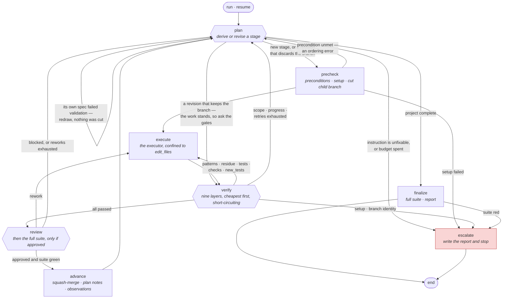

[](LICENSE)
# CodeGantry

Drives a long, multistage refactor across three model roles: an **executor**
that edits, a **planner** that decides what to do next, and a **reviewer** that
decides whether it was done acceptably. Each role is configured independently
and points at whatever model the operator chooses — local or hosted, same
provider or three different ones.

The operating goal is to run as long as feasible without a human. A ten-page plan
should execute in one unattended pass, producing a branch of granular,
individually green, individually reviewed commits you can examine and deploy from
on your own schedule.

[docs/architecture.md](docs/architecture.md) describes the system as built and is
the authority on *why* it works this way. This file is how to use it.

## Install

```bash
uv sync --group dev
uv run code-gantry --help
```

Requires Python 3.11+ and `git`. The executor runs in-process against the
provider's own SDK, so there is no agent binary to install.

## The four terms

| Term | What it is | Maps to |
|---|---|---|
| **project** | A body of work defined by a plan document | A config in the repository it describes, and a long-lived project branch |
| **stage** | One unit of work — the shippable unit | A child branch, squash-merged to the project branch |
| **attempt** | One executor invocation within a stage | A counter |
| **run** | One resumable execution session | `<work_dir>/runs/<id>/`; no branch |

There is **no static stage list**. The planner derives each stage from the plan
document as the run proceeds.

## The loop

Every arrow that is not the happy path is a failure with somewhere specific to
go. That is most of the diagram, and it is the point: the design goal is that a
run stops for a good reason or not at all, so each way a stage can go wrong has
a named destination rather than an exit code.



`resume` re-enters at whichever of `plan`, `precheck` or `verify` matches how the
run stopped — see [Escalation tiers](#escalation-tiers).

Three properties are easier to see here than to state. **Only three nodes reach
`escalate`**, and `review` is not one of them: a rejected stage is a planning
problem with a planning fix. **`advance` has exactly one exit**, so there is no
path that lands a stage and then does something other than plan the next one.
And **every cycle passes through a bounded counter** — executor attempts,
reworks, or planner interventions — so no loop in the diagram can run forever.

## Lifecycle

```bash
code-gantry init docs/my_plan.md       # draft a config from a plan document
code-gantry plan import docs/my_plan.md --follow-links   # the plan into the ledger
code-gantry validate [config]          # prove it works on this host
code-gantry run [config]               # go
code-gantry resume [config] [run_id]   # continue after an interruption or escalation
code-gantry status [config] [run_id]   # where it stopped and why
```

`init` may prompt — it's one-time human setup. `run` and `resume` execute
unattended and never block on input.

There is no approve step. A config is identified by its **git blob sha**,
recorded when a run starts and checked again on every resume, so editing it
ends the run it was read for rather than needing a command run against it.
There is no `approved: true` field, because such a field could be set by
anything, and nothing has to remember to re-approve.

## Commands

Eight commands and two groups. Every one but `init` takes the config path as
its first argument, and every one of those makes it optional: set
`CODE_GANTRY_CONFIG` and the path is typed once per shell instead of once per
command. `pause`, `resume` and `status` take an optional run id after it,
defaulting to the latest run for that project. `plan …` and `ledger …` are
the operator's side of the ledger and are described under *The ledger*.

### `init <plan-doc> [config]`

Drafts a config by inspecting the repository — the manifest and lockfile for
framework versions, a language-version file for the runtime, `bin/` and CI
workflows for the canonical test invocation, the compose file for services.
The config path defaults beside the plan document, because the plan and the
machinery that acts on it are one project.

Executable fields come from that inspection and never from a model. The draft
is headed *read every line before approving* and is meant to be edited: it
guesses, and a guess in a file full of shell commands about to run unattended
is the operator's to check.

### `validate [config]`

Proves the config works **on this host**, before a run: it runs
`setup_command`, the suite and the `checks`, and calls the model endpoints
with the credentials the config names. So reading the config is a review of
policy rather than of whether `bin/test` exists.

- `--skip-tests` — do the rest without running the suites. Useful when you are
  iterating on endpoints or paths and already know the suite's state, and
  wrong as a habit: the suites are most of what makes this command a proof.

### `run [config]`

Starts a run. Preflight repeats everything `validate` does and then some, so a
broken environment stops at the door rather than on stage thirty.

- `--run-id TEXT` — override the generated id. For scripting and for replaying
  a scenario under a name you choose; ordinarily let it generate one.
- `--skip-preflight-tests` — skip the suites during preflight. Faster to start,
  and it gives up the one check that tells a red repository from a red stage.
  A run that starts against an already-failing suite will blame the first
  stage for it.

### `pause [config] [run_id]`

Asks a running run to stop at the next boundary. **Not a kill.** The flag is
read before each planner call and again before `precheck`, so the stage in
flight lands or fails normally and the run stops with a clean tree.

Interrupting the process instead can leave a half-applied edit and a stage
branch nobody owns — and, if the interrupt lands mid-suite, test processes
holding database connections that the next run's setup cannot drop.

- `--note TEXT` — why, recorded for whoever comes back to it, which is usually
  you several hours later.

There is no `unpause`. `resume` clears the flag on its way in.

### `resume [config] [run_id]`

Continues after an interruption, or after a human has fixed what an escalation
asked for. It does **not** restart the stage: it re-enters the graph at the
node that matches how the run stopped — `verify` for a repository-state
failure, so your fix is checked rather than discarded; `plan` for a planning
failure; `precheck` for a stage that was derived but never started. Anything
else would re-run the stage from the top and throw the fix away.

- `--reset-progress-budget` — clear the without-landing intervention counter.

  `max_interventions_without_landing` is otherwise terminal. It is checked
  *before* the planner is called and only clears when a stage lands, so a run
  that hits it re-escalates on every resume without running anything. That is
  deliberate: a budget an operator can clear by re-running is not a budget,
  and the failure it guards against is precisely resume-in-a-loop.

  So the reset is asserted by a person and inferred from nothing. Editing the
  config does not clear it; neither does fixing the code. Use it when you have
  changed something that makes the earlier failures no longer apply — and know
  that you are the one claiming that, because the run cannot tell.

### `status [config] [run_id]`

Where a run stopped and why, read from the checkpoint without building
anything or running a model. Safe against a live run.

### `reconcile [config]`

Checks the plan against what the branch actually did and records the drift.
Plan items are written before the work and go stale during it. A run's own
plan notes catch drift as it happens; this is for drift that already
happened, by hand or by someone else or before the mechanism existed.
Deliberately separate from `run`, because reconciling is a judgement about
what the work has become and doing it mid-run would let a run rewrite its own
premises. It opens findings in the ledger, keyed to the items they are about.

- `--dry-run` — print the observations without writing them.

### Environment

- `CODE_GANTRY_CONFIG` — the config path, so it is typed once per shell.
- `CODE_GANTRY_PRICE_MAP` — path to a rate table, used instead of the default
  `model-prices.json` that the report and `stage-costs.md` price tokens from.

Credentials and endpoints are **not** named here. Each role's config declares
which variables hold them — `api_key_env`, `api_base_env` — so the names are
the project's to choose and no secret is ever written into a tracked file.

## The capability partition

Three models, three non-overlapping capabilities. This is the core safety
property; everything else is mechanism.

| Role | May write | May not |
|---|---|---|
| **Executor** | Product code inside the stage's `edit_files` | Anything outside it; any command it was not declared; **any code the planner authored for it** |
| **Planner** | Stage specs — declarative fields only — plan revisions, the status log | Product code; **any executable field**; **any fenced code block in an instruction** |
| **Reviewer** | Nothing | Everything |

**The planner does not write code either**, which is the same partition one
field along and the harder half to see: a replacement block names nothing
executable and is still the planner writing the diff. Quoting goes through
`read_excerpts` — a path and a line range, read at the stage's starting
commit — because *a reference can only point at code that already exists*, so
an after-image is unexpressible rather than merely discouraged.
`validate_stage` rejects a fenced block in an instruction; inline backticks are
left alone, since naming an identifier is a property.

The planner and reviewer both **read** the repository through the same bounded
tools — read a file, list files, search — under separate per-role line and call
budgets. The reviewer got them because a diff does not always carry the fact that
settles it: a stage deleting a declaration is safe exactly when something
elsewhere still covers what it did, and that file is not in the diff. A gate that
cannot reach its evidence produces verdicts indistinguishable from judgement,
and the artifact reads the same either way — so the run log records what each
role *looked at*, not only what it decided.

**The planner may never author a command.** It is enforced twice: its
structured-output schema has no field for one, and its response is filtered
against an allowlist regardless. CodeGantry never runs a shell command that
originated from model output — every command it executes is declared by you in a
config you wrote.

Where the planner needs to influence a command, it supplies *arguments*:

```yaml
scoped_test_command: "docker compose run --rm test <your runner> {paths}"
```

`{paths}` is filled from the stage diff, optionally widened by planner-declared
spec globs. Paths are declarative; the command string is yours.

### Tools you declare, and who may call them

`project_tools` is a menu you write. Each entry is a name, a description the
model reads, and an **argv list** — never a shell, which is the whole safety
story: a value the model supplies is one inert element, so there is no
metacharacter to escape. A placeholder must occupy a whole element, so a
repeated value expands into elements rather than needing a quoting rule.

Each tool names its audience. `roles` defaults to `["executor"]`, which is what
every declaration written before the field existed meant:

```yaml
project_tools:
  - name: install_dependencies
    description: Install what the manifest names, in the app container.
    command: ["docker", "compose", "exec", "-T", "app", "<your installer>"]
    # roles: ["executor"] — the default

  - name: dependency_search
    description: >
      Search one dependency's installed source. Its own directory is the root.
    command: ["docker", "compose", "exec", "-T", "app", "sh", "-c", "…",
              "_", "{dependency}", "{pattern}"]
    roles: ["planner", "reviewer"]
    arguments:
      - name: dependency
        description: The dependency, named as the manifest names it.
      - name: pattern
        description: A regular expression.
```

Scope by what a tool *does*, not by who asked for it. The menu's original
entries write — a dependency installer rewrites a lockfile, a framework's own
generator overwrites templated config — and the executor is the only role that
runs inside the quarantine a stage branch provides, where the scope gate
measures from the tree what was touched. A planner that dirtied the work tree
mid-derivation would be caught by the *next* stage's precheck, which refuses to
cut a branch over changes it cannot attribute — stopping a run on a stage with
nothing wrong with it.

A **read-only** tool is the case `roles` exists for. Where a project keeps
source the work tree does not contain — a dependency installed into a container
volume, say — no built-in read tool can reach it, and the planner is the role
that most needs it: it decides what work to draw, and a premise it cannot check
is one it guesses at or declares undrawable.

Three things follow, and each is enforced rather than described:

- **Being offered a tool and being allowed to run it are two checks.** Both the
  schema a role is shown and the dispatcher that runs its calls scope through
  the same selector. A model can name anything; a filter over what is
  advertised is not a boundary.
- **The planner is told what the executor can run, separately from what it can
  run itself.** Both matter. It reasons about executor tools it cannot call —
  on one run it ruled a framework bump undrawable partly from what a generator
  overwrites — and it must not write a stage instruction that depends on a tool
  the executor was never given, because that instruction cannot be carried out
  and the attempt is spent finding out.
- **What a declared tool returns is charged to the same read budget as a file.**
  It lands in the same context window, and it is the one channel that can
  return a whole vendored directory.

## Branch topology

```
main
 └── feature/thing                    # cut once; the tool never merges it

feature/thing-stage/001-<id>          # child branch; squash-merged, then deleted
feature/thing-stage/002-<id>
```

Child branches sit **beside** the project branch, not under it — git refs are
filesystem paths, so `refs/heads/feature/thing` and
`refs/heads/feature/thing/stage-001` cannot coexist.

A stage squash-merges on approval, so the executor's intermediate commits —
some red, since it commits before it tests — never reach the project branch.
That's how "every commit on the project branch is green" and "the executor
commits before it tests" are both true.

Two commits per stage reach the project branch, in this order:

```
[<stage-id>] plan observations from deriving this stage   # written by precheck
[<stage-id>]                                              # the squash merge
```

The first is the planner's findings about the plan, written when the branch is
cut rather than when the stage lands — their truth does not depend on the stage
succeeding, and a stage that escalates used to take them with it. The second is
the landing, and its body is the reviewer's account of what the stage did: the
only description written by a participant that has seen the diff. `git log` on
the project branch therefore answers what happened, not what was asked for.

The outer merge to `main` is yours. The tool never pushes.

## The verify gate

Ordered cheapest-first, short-circuiting. Routing is three-way:

| # | Gate | On failure |
|---|---|---|
| 0 | `setup_command` | **Human** — a broken environment isn't a planning defect |
| 1 | Branch identity — HEAD where expected, nothing rewritten | **Human** — a containment breach doesn't negotiate |
| 2 | Scope — the diff is non-empty, touches no plan document, and stays inside `edit_files` | Executor if it produced nothing; **Planner** otherwise — widen the stage, or revert just those paths |
| 3 | Progress — this diff is not byte-identical to the last one | **Planner** — feedback changed nothing, so another attempt buys nothing |
| 4 | `forbidden_patterns` against **added lines only** | Executor retry |
| 5 | `must_not_remain` against **file contents** | Executor retry |
| 6 | `checks` — each must exit zero | Executor retry |
| 7 | `test_command` (re-run once before consuming a retry) | Executor retry |
| 8 | `require_new_tests` — a test file was touched, and what it touched is not empty | Executor retry |

**Checks run before tests, because a check may write.** Autocorrecting linters
exit zero *after* rewriting files, and `checks_commit_changes` commits what
they rewrote — so running the suite first makes its green describe bytes that
are not the ones landing. The executor's loop always had this order; the gate
had the older one, from when nothing between the suite and the merge could
change a file.

Layers 4 and 5 read almost identically in prose and are opposites in a diff.
`forbidden_patterns` asks what the stage **introduced**; `must_not_remain` asks
what **survived**. A stage told to delete something needs the second, and the
first will never notice.

The emptiness half of layer 8 applies whether or not the stage was required to
write tests — `require_new_tests` governs whether a stage *must* write them, not
whether a file it did write is worth anything.

A scope violation **never discards the branch.** The child branch is already the
quarantine, so containment doesn't require destroying work: the planner gets the
out-of-scope path list, and if it widens `edit_files` the existing work stands.
Only paths it declines get reverted — hours of correct work don't die because one
unexpected spec got touched.

## The merge gate

**A stage lands when the reviewer approves it *and* the full suite is green.**
Evaluated cheapest-first: the reviewer is seconds and pennies, a full suite is
minutes, so a stage the reviewer would reject never pays for a suite run. Because
the suite runs only after approval, it costs one execution per stage that
lands — linear in stages, not in attempts.

Reviewer verdicts:

- **approved** → full suite, then merge.
- **rework** → back to the executor with the issues *and the diff the stage has
  accumulated so far*, for the three tries `max_rework_retries` allows. A
  reviewer leaves comments on the work in front of it; it does not ask for the
  work again. Set `rework_reset: true` to discard the attempt and start from the
  stage baseline instead — but know what that turns the retries into, since an
  attempt that begins from nothing carries nothing forward but the feedback
  sentence.
- **blocked** → the instruction itself is wrong. Routes to the **planner**, not a
  human: with a planner in the loop, that's a planning problem with a planning
  fix.

### When the suite is red for reasons the stage didn't cause

Legacy suites are rarely order-independent, and a stage should not be blamed for
that. When a broad suite fails, CodeGantry re-runs **the files that failed,
on their own**. A file that passes whole *and* standalone is green: that tests
order dependence directly, instead of re-rolling every other example in the suite
and hoping.

```yaml
flake_rerun_failed_files: true    # default
failed_file_pattern: …            # regex; group 1 is a re-runnable path
flake_rerun_max_files: 5
seed_pattern: …                   # regex; group 1 is the ordering seed
```

The paths come from the test runner's own stdout and are substituted into
`scoped_test_command`. One guard keeps this from laundering real failures:
past `flake_rerun_max_files`, a red suite is a broken stage rather than a flake,
and the re-run is skipped — thirty files do not flake simultaneously.

There is deliberately **no ownership rule**. An earlier design refused to excuse
a file the stage had edited, reasoning that the stage might have introduced the
order dependence. But a file that passes whole and standalone has been proven
green *including* the stage's edits to it, so whatever makes it fail in the group
is a property of the suite — to be fixed as its own work rather than charged to
whichever stage was in flight.

Every excusal is appended to `flakes.jsonl` in the work directory as one JSON
record carrying the file, the timestamp, the ordering seed, and the runner's own
locators for the examples that failed. It earns its keep by being countable: one
record is noise, twenty naming the same *example* is a work item — and a file
answers a coarser question than the one worth asking, since a file's failures
are as likely to be siblings sharing a setup as separate defects.
Preflight adjudicates the same way, so a run is not refused at the door by the
one failure the merge gate would have forgiven.

## Escalation tiers

1. **Executor retry** — bounded by `max_test_retries` / `max_rework_retries`.
2. **Planner intervention** — the stage was drawn wrongly. Bounded by
   `max_planner_interventions`, which is **global across the run**: per-stage caps
   let a pathological project consume unbounded paid inference one stage at a
   time.
3. **Human** — everything the planner couldn't fix, plus setup and
   branch-identity failures.

There is **no planned human step**. A human's involvement means something broke,
so a deliberate mid-run pause would contradict one-shotting a plan. Work
CodeGantry can't do escalates, you do it, and `resume` verifies it.

`resume` re-enters based on how the run stopped: at `verify` for a
repository-state failure, so your fix is checked rather than discarded; at the
planner for a planning failure. The clean-tree requirement is start-only, since
your fix is normally uncommitted.

`code-gantry pause` is the exception, and it is not a step in the plan — it is
how you stop a healthy run to change something. It writes a flag that is read
before each planner call and again before `precheck`, so the run finishes
whatever stage is in flight, lands it or fails it normally, and stops with a
clean tree and nothing half-done. Interrupting the process instead can leave a
partly applied edit and a stage branch nobody owns.

There is no `unpause`. `resume` clears the flag on its way in, so a pause you
change your mind about is undone by deleting `runs/<run-id>/paused` — which
works right up until the run reads it, and a run inside a derivation has not
read it yet.

## What each role is given to read

Three documents, three audiences, and the split is by what a reader can act on.

| | Conventions (`agent_context`) | Operations (`operations_context`) |
|---|---|---|
| Planner | ✓ | ✓ |
| Executor | ✓ (as `--read`) | — |
| Reviewer | ✓ | — |

Conventions — how code here has to look — bind anything that writes or judges
code. Operations — build, test, deploy — belong to the planner alone: it is the
role that decides what is *possible*, and the one that read five plan items as
blocked because nobody had told it the container reinstalls dependencies when
the manifest changes. The executor runs only the tools you declare to it, so a
page of commands it has no way to invoke invites it to narrate one it never
ran.

The executor receives its copy inside the cached prefix, ahead of the plan and
inside the same breakpoint. Both are fixed for the life of a run, so that
placement is paid for once rather than per stage — and the model it is sent to
caches at an explicit breakpoint without falling back to the longest matching
prefix, so static content placed after the mark misses every time.

## The ledger

The plan lives in a per-project SQLite file under the work dir, `ledger.db`,
as a tree of nodes — documents, sections, items — each with a key like
`{#r5.017}`, a prose body, an owner (`pipeline` or `human`) and a blocking
flag. Markdown is the import and export format: `code-gantry plan import`
reads the documents you already keep, closed items becoming `landed` or
`struck` records with their sha and evidence, and `plan export` renders a
document back for editing and re-import.

The file holds one append-only table of events, each stamped with the origin
that wrote it and a per-origin sequence. The tree, each key's state and the
findings table are derived from those events on read, never stored. That is
what lets a later host exchange ledgers by fetching "origin X after seq N".

**What the planner is sent is rendered from it.** The stable half — the tree
with its keys and the marks a fold has written — sits in the cached block. The
projection — landings not yet marked, keys claimed by other runs, questions
waiting on a person, and open findings with their ids — follows the cache
mark. When the projection grows past `ledger.fold_ratio` of the plan text the
run folds: marks and answered findings move into the node bodies, with no
model and no commit.

**A stage cites keys.** `plan_keys` names the items it is drawn from; precheck
claims them and a landing closes them. `resolves` proposes open findings the
diff will settle, and the reviewer's `resolved` list is what actually closes
them. A finding a planner note opens carries `needs: pipeline` or
`needs: human`; the human ones sit in a queue until answered.

Operator commands:

- `plan import <paths…> [--follow-links] [--owner human] [--blocking]`,
  `plan export <key>`, `plan show <key>`, `plan add --under <key> --title …`,
  `plan edit <key> [--owner pipeline]`, `plan retire <key>`.
- `ledger show [--open|--claimed|--blocked|--landed] [key]`,
  `ledger findings [--for-human]`, `ledger answer <id> fold|discard|debt|raise
  [--text …]`, `ledger claim|release|land|strike|block|unblock <key> …`,
  `ledger fold`, `ledger render [--projection]`.

`CODE_GANTRY_ACTOR` names who is writing (default: your login);
`CODE_GANTRY_ORIGIN` names the host (default: its hostname). The landing
commit carries the same references as trailers — `Plan-Keys`, `Resolves`,
the three role models, `Config`, `Stage-Base`, `Bay` — so git is the durable
copy of what the ledger records.

## Output

```
<target-repo>/docs/<project>/
  code_gantry.yaml                         # the config, tracked and reviewed
  .code_gantry/                            # everything written; gitignored
    ledger.db          status.md           # the plan; append-only expected-vs-actual log
    flakes.jsonl       stage-costs.md
    runs/<run_id>/
      report.md        run.log   state.db  run.json   tool.log
      stages/<n>-<id>-rev-<r>-attempt-<m>/
        prompt.md  executor.log  verify.log  review.json  planner.json
        sent-prompt.md  executor-conversation.jsonl  executor-loop.json
```

The config lives in the repository it describes, beside the plan, so the two
land in one commit and are reviewed together. `target_repo` and `work_dir` are
derived from where the config was read rather than declared, because a tracked
file must not carry one machine's paths.

The executor's two artifacts are written **while the attempt is running**, not
when it returns, which is what makes a stage that is taking too long something
you can look at rather than only wait for. `sent-prompt.md` is everything the
model was given, readable, and is on disk before the first call. The transcript
is one JSON object per line — every tool call and every result, appended as it
happens:

```sh
tail -f .../executor-conversation.jsonl \
  | jq -r '"\(.type // .role) \(.name // "") \(.arguments // "")"'
```

`executor-loop.json` is the totals — cycles, edits, refusals, usage, cost — so
it is written once, at the end.

`status.md` is append-only by design. A status page that always showed current
state would discard the divergence over time between what the plan expected and
what happened — which is the reason to keep it.

`report.md` gives each stage a pull-request-shaped record, and warns if the
reviewer's cached-token proportion drops below half: the plan snapshot and
completed history are meant to be a stable cacheable prefix, so a low figure
means every review is costing more than it should.

Its cost section names the model **and the reasoning effort** beside each
role's figure, and prices the tokens from a public rate table rather than one
of ours — fetched once and cached, so the report and `stage-costs.md`
cannot disagree about what a token costs and no rate is maintained by hand. A
model with no entry reports `not priced` rather than `$0.00`; a priced model
that spent nothing still reports `$0.00`, and those are different facts.

Effort is recorded rather than priced because nothing in that table is keyed by
it. Effort buys reasoning tokens, billed at the ordinary output rate, so its
whole cost is already in the completion count — what was missing was the label
saying which effort produced it.

## Safety

- Refuses to continue a run whose config has changed, by the file's git blob
  sha.
- A **denylist** refuses `git push`, `git checkout`/`switch`, `git merge`,
  `git reset`, deploy tools, `sudo`, and recursive `rm` in any configured
  command — *regardless of what the config says*. A human skims a sixty-line YAML once,
  motivated to start a run; this is the backstop for that moment.
- Commits only to the project branch and its children. **No push method
  exists.**
- `gc.auto` is disabled for the run, so the reflog can recover a discarded
  attempt.
- Every commit passes `-c commit.gpgsign=false`: an unattended run can't answer a
  pinentry prompt.

## Tests

```bash
uv run pytest -n auto
```

The suite drives the real graph, checkpointer, verify layers, git operations and
branch topology against fixture repos. Only the three model calls are stubbed.
`-n auto` is the difference between about 25 seconds and several minutes; it is
not in `addopts` because a single-test run would pay worker startup for nothing.

```bash
uv run python scripts/smoke.py          # ~15s, no network, no API keys
uv run python scripts/smoke.py --keep   # leave the sandbox for inspection
```

The smoke test covers the one thing `pytest` cannot: that the CLI, run from a
shell against a real git repository, completes a whole project unattended.
`init → validate → run`, then it asserts the promises — child branches deleted,
`main` untouched, one squashed commit per stage, `gc.auto` restored, artifacts
written.

One HTTP server stands in for all three models, answering `/v1/messages` in
Anthropic's wire format for the planner, `/v1/chat/completions` in OpenAI's for
the reviewer, and `/v1/responses` for the executor. The real SDKs, the real
parsing and the real defensive paths all run; only the inference is fake.
Everything else — git, the merges, the checkpointer, the subprocess runner — is
real.

The stand-in planner derives its answer from **what has landed on the project
branch**, not from a call counter, so it is idempotent under retries. A
counter-driven stub hands out a different stage on every rework, and the
confusion looks exactly like a CodeGantry bug.

## License

Copyright 2026 Mack Earnhardt

Licensed under the Apache License, Version 2.0 (the "License");
you may not use this file except in compliance with the License.
You may obtain a copy of the License at

    http://www.apache.org/licenses/LICENSE-2.0

Unless required by applicable law or agreed to in writing, software
distributed under the License is distributed on an "AS IS" BASIS,
WITHOUT WARRANTIES OR CONDITIONS OF ANY KIND, either express or implied.
See the License for the specific language governing permissions and
limitations under the License.
